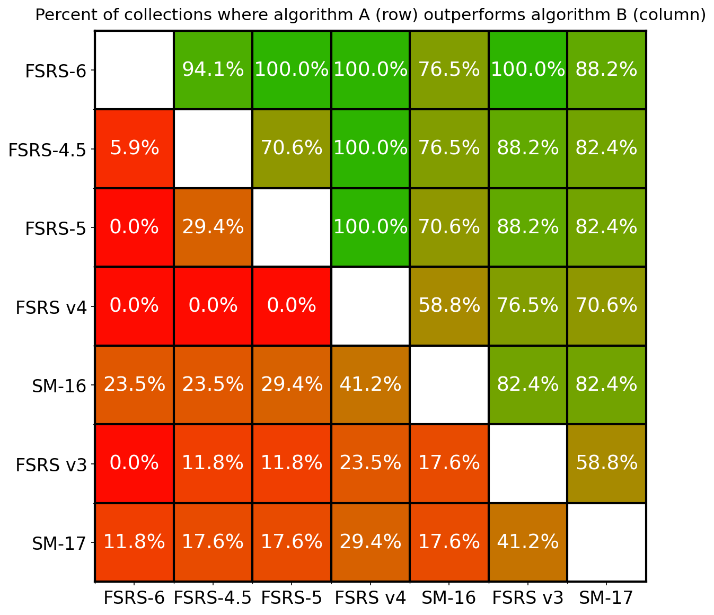

# FSRS vs SM-17
<!-- ALL-CONTRIBUTORS-BADGE:START - Do not remove or modify this section -->

<!-- ALL-CONTRIBUTORS-BADGE:END -->

It is a simple comparison between FSRS and SM-17. Due to the difference between the workflow of SuperMemo and Anki, it is not easy to compare the two algorithms. I tried to make the comparison as fair as possible. Here is some notes:
- The first interval in SuperMemo is the duration between creating the card and the first review. In Anki, the first interval is the duration between the first review and the second review. So I removed the first record of each card in SM-17 data.
- There are six grades in SuperMemo, but only four grades in Anki. So I merged 0, 1 and 2 in SuperMemo to 1 in Anki, and mapped 3, 4, and 5 in SuperMemo to 2, 3, and 4 in Anki.
- I use the `R (SM17)` recorded in `sm18/systems/{collection_name}/stats/SM16-v-SM17.csv` as the prediction of SM-17. Reference: [Confusion among R(SM16), R(SM17)(exp), R(SM17), R est. and expFI.](https://supermemopedia.com/wiki/Confusion_among_R(SM16),_R(SM17)(exp),_R(SM17),_R_est._and_expFI.)
- To ensure FSRS has the same information as SM-17, I implement an [online learning](https://en.wikipedia.org/wiki/Online_machine_learning) version of FSRS, where FSRS has zero knowledge of the future reviews as SM-17 does.
- The results are based on the data from a small group of people. It may be different from the result of other SuperMemo users.

### Metrics

We use three metrics in the SRS benchmark to evaluate how well these algorithms work: Log Loss, AUC, and a custom RMSE that we call RMSE (bins).

- Log Loss (also known as Binary Cross Entropy): used primarily in binary classification problems, Log Loss serves as a measure of the discrepancies between predicted probabilities of recall and review outcomes (1 or 0). It quantifies how well the algorithm approximates the true recall probabilities. Log Loss ranges from 0 to infinity, lower is better.
- Root Mean Square Error in Bins (RMSE (bins)): this is a metric designed for use in the SRS benchmark. In this approach, predictions and review outcomes are grouped into bins based on three features: the interval length, the number of reviews, and the number of lapses. Within each bin, the squared difference between the average predicted probability of recall and the average recall rate is calculated. These values are then weighted according to the sample size in each bin, and then the final weighted root mean square error is calculated. This metric provides a nuanced understanding of algorithm performance across different probability ranges. For more details, you can read [The Metric](https://github.com/open-spaced-repetition/fsrs4anki/wiki/The-Metric). RMSE (bins) ranges from 0 to 1, lower is better.
- AUC (Area under the ROC Curve): this metric tells us how much the algorithm is capable of distinguishing between classes. AUC ranges from 0 to 1, however, in practice it's almost always greater than 0.5; higher is better.

Log Loss and RMSE (bins) measure calibration: how well predicted probabilities of recall match the real data. AUC measures discrimination: how well the algorithm can tell two (or more, generally speaking) classes apart. AUC can be good (high) even if Log Loss and RMSE are poor.

## Result

Total users: 17

Total repetitions: 358,733

The following tables present the means and the 99% confidence intervals. The best result is highlighted in **bold**. Arrows indicate whether lower (↓) or higher (↑) values are better.

### Weighted by number of repetitions

| Algorithm | Log Loss↓ | RMSE (bins)↓ | AUC↑ |
| --- | --- | --- | --- |
| **FSRS-6** | **0.379±0.040** | **0.040±0.020** | **0.688±0.045** |
| FSRS-4.5 | 0.393±0.041 | 0.056±0.030 | 0.677±0.043 |
| FSRS-5 | 0.393±0.041 | 0.056±0.031 | 0.678±0.043 |
| FSRSv4 | 0.408±0.047 | 0.068±0.042 | 0.669±0.044 |
| AVG | 0.409±0.051 | 0.086±0.016 | 0.544±0.025 |
| SM-16 | 0.432±0.058 | 0.101±0.021 | 0.615±0.026 |
| FSRSv3 | 0.449±0.066 | 0.098±0.027 | 0.622±0.036 |
| SM-17 | 0.471±0.055 | 0.076±0.012 | 0.615±0.037 |

### Unweighted (per user)

| Algorithm | Log Loss↓ | RMSE (bins)↓ | AUC↑ |
| --- | --- | --- | --- |
| **FSRS-6** | **0.410±0.062** | **0.084±0.027** | **0.633±0.040** |
| AVG | 0.420±0.077 | 0.097±0.022 | 0.509±0.031 |
| FSRS-4.5 | 0.437±0.067 | 0.113±0.035 | 0.631±0.038 |
| FSRS-5 | 0.442±0.067 | 0.118±0.039 | 0.630±0.038 |
| SM-16 | 0.46±0.11 | 0.121±0.033 | 0.609±0.023 |
| FSRSv4 | 0.484±0.075 | 0.152±0.052 | 0.617±0.039 |
| SM-17 | 0.494±0.092 | 0.095±0.026 | 0.603±0.033 |
| FSRSv3 | 0.53±0.12 | 0.150±0.043 | 0.604±0.036 |

Averages weighted by the number of reviews are more representative of "best case" performance when plenty of data is available. Since almost all algorithms perform better when there's a lot of data to learn from, weighting by n(reviews) biases the average towards lower values.

Unweighted averages are more representative of "average case" performance. In reality, not every user will have hundreds of thousands of reviews, so the algorithm won't always be able to reach its full potential.

### Universal Metric

The universal metric is proposed by SuperMemo. Reference: [Universal metric for cross-comparison of spaced repetition algorithms](https://supermemo.guru/wiki/Universal_metric_for_cross-comparison_of_spaced_repetition_algorithms).

| Algorithm | Universal Metric↓ |
|-----------|------------------|
| **FSRS-6** | **0.0206** |
| SM-16 | 0.0404 |
| FSRS-4.5 | 0.0449 |
| FSRS-5 | 0.0458 |
| SM-17 | 0.0501 |
| FSRSv3 | 0.0535 |
| FSRSv4 | 0.0581 |
| AVG | 0.0625 |

### Superiority

The metrics presented above can be difficult to interpret. In order to make it easier to understand how algorithms perform relative to each other, the image below shows the percentage of users for whom algorithm A (row) has a lower Log Loss than algorithm B (column). For example, FSRS-6 has a 88.2% superiority over SM-17, meaning that for 88.2% of all collections in this benchmark, FSRS-6 can estimate the probability of recall more accurately.

This table is based on 17 collections.

### Statistical significance

The figures below show effect sizes comparing the Log Loss between all pairs of algorithms using the Wilcoxon signed-rank test r-values:

The colors indicate:

- Red shades indicate the row algorithm performs worse than the column algorithm:
  - Dark red: large effect (r > 0.5)
  - Red: medium effect (0.5 ≥ r > 0.2) 
  - Light red: small effect (r ≤ 0.2)

- Green shades indicate the row algorithm performs better than the column algorithm:
  - Dark green: large effect (r > 0.5)
  - Green: medium effect (0.5 ≥ r > 0.2) 
  - Light green: small effect (r ≤ 0.2)

- Grey indicates that the p-value is greater than 0.05, meaning we cannot conclude which algorithm performs better.

The Wilcoxon test considers both the sign and rank of differences between pairs, but it does not account for the varying number of reviews across collections. Therefore, while the test results are reliable for qualitative analysis, caution should be exercised when interpreting the specific magnitude of effects.

## Share your data

If you would like to support this project, please consider sharing your data with us. The shared data will be stored in [./dataset/](./dataset/) folder. 

You can open an issue to submit it: https://github.com/open-spaced-repetition/fsrs-vs-sm17/issues/new/choose

## Contributors

<!-- ALL-CONTRIBUTORS-LIST:START - Do not remove or modify this section -->
<!-- prettier-ignore-start -->
<!-- markdownlint-disable -->
<table>
  <tbody>
    <tr>
      <td align="center" valign="top" width="14.28%"><a href="https://github.com/leee-z"> <b>leee_</b></a> <a href="#data-leee-z" title="Data">🔣</a></td>
      <td align="center" valign="top" width="14.28%"><a href="https://www.zhihu.com/people/L.M.Sherlock"> <b>Jarrett Ye</b></a> <a href="#data-L-M-Sherlock" title="Data">🔣</a></td>
      <td align="center" valign="top" width="14.28%"><a href="https://github.com/Shore3145"> <b>天空守望者</b></a> <a href="#data-Shore3145" title="Data">🔣</a></td>
      <td align="center" valign="top" width="14.28%"><a href="https://github.com/reallyyy"> <b>reallyyy</b></a> <a href="#data-reallyyy" title="Data">🔣</a></td>
      <td align="center" valign="top" width="14.28%"><a href="https://github.com/shisuu"> <b>shisuu</b></a> <a href="#data-shisuu" title="Data">🔣</a></td>
      <td align="center" valign="top" width="14.28%"><a href="https://github.com/WinstonWantsAUserName"> <b>Winston</b></a> <a href="#data-WinstonWantsAUserName" title="Data">🔣</a></td>
      <td align="center" valign="top" width="14.28%"><a href="https://github.com/VSpade7"> <b>Spade7</b></a> <a href="#data-VSpade7" title="Data">🔣</a></td>
    </tr>
    <tr>
      <td align="center" valign="top" width="14.28%"><a href="https://noheartpen.github.io/"> <b>John Qing</b></a> <a href="#data-NoHeartPen" title="Data">🔣</a></td>
      <td align="center" valign="top" width="14.28%"><a href="https://github.com/WolfSlytherin"> <b>WolfSlytherin</b></a> <a href="#data-WolfSlytherin" title="Data">🔣</a></td>
      <td align="center" valign="top" width="14.28%"><a href="https://github.com/Hy-Fran"> <b>HyFran</b></a> <a href="#data-Hy-Fran" title="Data">🔣</a></td>
      <td align="center" valign="top" width="14.28%"><a href="https://github.com/Hansel221"> <b>Hansel221</b></a> <a href="#data-Hansel221" title="Data">🔣</a></td>
      <td align="center" valign="top" width="14.28%"><a href="https://github.com/nocturne2014"> <b>曾经沧海难为水</b></a> <a href="#data-nocturne2014" title="Data">🔣</a></td>
      <td align="center" valign="top" width="14.28%"><a href="https://github.com/KKKphelps"> <b>Pariance</b></a> <a href="#data-KKKphelps" title="Data">🔣</a></td>
      <td align="center" valign="top" width="14.28%"><a href="https://github.com/github-gracefeng"> <b>github-gracefeng</b></a> <a href="#data-github-gracefeng" title="Data">🔣</a></td>
    </tr>
    <tr>
      <td align="center" valign="top" width="14.28%"><a href="https://github.com/hugomarins"> <b>Hugo Marins</b></a> <a href="#data-hugomarins" title="Data">🔣</a></td>
    </tr>
  </tbody>
</table>

<!-- markdownlint-restore -->
<!-- prettier-ignore-end -->

<!-- ALL-CONTRIBUTORS-LIST:END -->
<!-- prettier-ignore-start -->
<!-- markdownlint-disable -->

<!-- markdownlint-restore -->
<!-- prettier-ignore-end -->

<!-- ALL-CONTRIBUTORS-LIST:END -->
