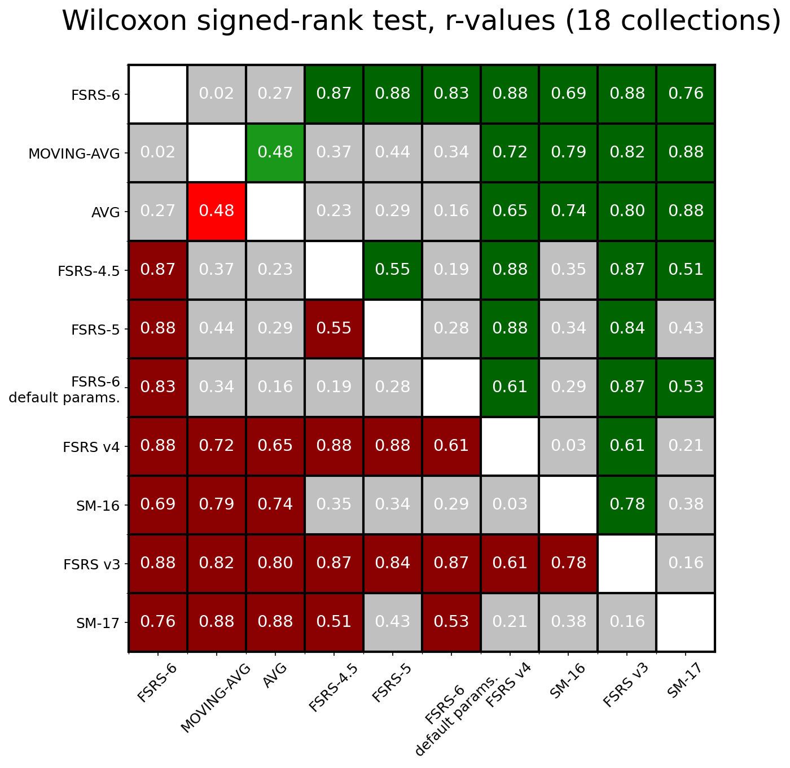

# FSRS vs SM-17
<!-- ALL-CONTRIBUTORS-BADGE:START - Do not remove or modify this section -->

<!-- ALL-CONTRIBUTORS-BADGE:END -->

It is a simple comparison between FSRS and SM-17. Due to the difference between the workflow of SuperMemo and Anki, it is not easy to compare the two algorithms. I tried to make the comparison as fair as possible. Here is some notes:
- The first interval in SuperMemo is the duration between creating the card and the first review. In Anki, the first interval is the duration between the first review and the second review. So I removed the first record of each card in SM-17 data.
- There are six grades in SuperMemo, but only four grades in Anki. So I merged 0, 1 and 2 in SuperMemo to 1 in Anki, and mapped 3, 4, and 5 in SuperMemo to 2, 3, and 4 in Anki.
- I use the `R (SM17)` recorded in `sm18/systems/{collection_name}/stats/SM16-v-SM17.csv` as the prediction of SM-17. Reference: [Confusion among R(SM16), R(SM17)(exp), R(SM17), R est. and expFI.](https://supermemopedia.com/wiki/Confusion_among_R(SM16),_R(SM17)(exp),_R(SM17),_R_est._and_expFI.)
- To ensure FSRS has the same information as SM-17, I implement an [online learning](https://en.wikipedia.org/wiki/Online_machine_learning) version of FSRS, where FSRS has zero knowledge of the future reviews as SM-17 does.
- The results are based on the data from a small group of people. It may be different from the result of other SuperMemo users.

## Metrics

### Universal Metric

The Universal Metric is a mathematical tool proposed by SuperMemo for reliable comparison of different spaced repetition algorithm implementations. It measures the accuracy of retrievability predictions by comparing predicted probabilities with actual recall outcomes.

**How it works:**
- Predictions are grouped into bins based on predicted retrievability values
- Within each bin, the root mean square error is calculated between predicted and actual recall rates
- The metric is weighted by sample size in each bin
- Lower values indicate better prediction accuracy

Reference: [Universal metric for cross-comparison of spaced repetition algorithms](https://supermemo.guru/wiki/Universal_metric_for_cross-comparison_of_spaced_repetition_algorithms).

**Disclaimer**: I cannot guarantee that I have implemented the universal metric proposed by the SuperMemo team with 100% accuracy, as they have not released their evaluation code. My implementation is based solely on their documentation.

**Note**: The Universal Metric in a cross-comparison setting has a theoretical vulnerability to gaming if a model has access to all other models' predictions. Since bins are constructed based on the referee algorithm's predictions, an adversarial model could track these bins and craft predictions to minimize its Universal Metric scores across all comparisons. This is similar to the RMSE (bins) exploit. However, this vulnerability is not a practical concern for this benchmark because:
1. All code and data are open-source and transparent
2. We use multiple complementary metrics (Log Loss, AUC, RMSE) to validate results
3. Gaming attempts would be easily detectable in the community review process

#### Adversarial baseline

To demonstrate the issue concretely we include an `ADVERSARIAL` model in the benchmark results. The attacker observes every referee's probability for the current review, uses the AVG model as an estimate of `P(y=1)`, and then evaluates 11 candidate predictions in `[0, 1]`. For each candidate it projects how every referee's Universal Metric would change if the next outcome were 0 or 1, and chooses the probability that minimises the expected UM. Because the prediction is made before the true label is revealed, the attacker remains causal (no future information is used) yet still drives its UM scores toward zero against every referee.

### Traditional Machine Learning Metrics

We also use three traditional metrics in the SRS benchmark: Log Loss, AUC, and a custom RMSE that we call RMSE (bins).

- Log Loss (also known as Binary Cross Entropy): used primarily in binary classification problems, Log Loss serves as a measure of the discrepancies between predicted probabilities of recall and review outcomes (1 or 0). It quantifies how well the algorithm approximates the true recall probabilities. Log Loss ranges from 0 to infinity, lower is better.
- Root Mean Square Error in Bins (RMSE (bins)): this is a metric designed for use in the SRS benchmark. In this approach, predictions and review outcomes are grouped into bins based on three features: the interval length, the number of reviews, and the number of lapses. Within each bin, the squared difference between the average predicted probability of recall and the average recall rate is calculated. These values are then weighted according to the sample size in each bin, and then the final weighted root mean square error is calculated. This metric provides a nuanced understanding of algorithm performance across different probability ranges. For more details, you can read [The Metric](https://github.com/open-spaced-repetition/fsrs4anki/wiki/The-Metric). RMSE (bins) ranges from 0 to 1, lower is better.
- AUC (Area under the ROC Curve): this metric tells us how much the algorithm is capable of distinguishing between classes. AUC ranges from 0 to 1, however, in practice it's almost always greater than 0.5; higher is better.

Log Loss and RMSE (bins) measure calibration: how well predicted probabilities of recall match the real data. AUC measures discrimination: how well the algorithm can tell two (or more, generally speaking) classes apart. AUC can be good (high) even if Log Loss and RMSE are poor.

## Result

Total users: 18

Total repetitions: 652,278

### Universal Metric

| Algorithm | Average Universal Metric↓ |
| --- | --- |
| **ADVERSARIAL** | **0.0011** |
| FSRS-6 | 0.0283 |
| MOVING-AVG | 0.0420 |
| SM17 | 0.0442 |
| FSRS-4.5 | 0.0480 |
| FSRS-5 | 0.0490 |
| SM16 | 0.0543 |
| AVG | 0.0593 |
| FSRSv4 | 0.0594 |
| FSRSv3 | 0.0666 |
| FSRS-6-default | 0.0801 |

### Universal Metrics Matrix

The Universal Metrics matrix provides a comprehensive cross-comparison view of all algorithms. Each cell shows the Universal Metric for algorithm A (row) when using algorithm B's (column) predictions as the reference for binning. In other words, it measures how well algorithm A's predictions match actual recall outcomes when grouped by algorithm B's predicted retrievability values. The matrix is sorted by performance, with the best-performing algorithms in the top-left corner.

**Why use different algorithms for binning?**

Using different algorithms for binning (the "referee") helps mitigate simple gaming strategies. For example, an algorithm that always predicts values close to the dataset's average success rate (e.g., always predicting R=0.9) would show large errors when binned by another algorithm's predictions across bins with different true recall rates.

However, this approach does not fully prevent gaming if an adversarial model has access to all other models' predictions in advance (see Security Note above). The average Universal Metric score across all reference algorithms (shown in the ranking table above) provides a measure of each algorithm's overall prediction accuracy under the assumption of honest participation.

**Color interpretation:**
- **Light colors**: Low Universal Metric (high prediction accuracy)
- **Dark colors**: High Universal Metric (low prediction accuracy)
- **Diagonal cells**: Show "-" (not applicable when binning by the same algorithm)

This visualization helps identify which algorithms produce the most robust and accurate retrievability predictions across different evaluation perspectives.

### Universal Metrics+ (Cross Comparison)

| Algorithm | UM+↓ (Max) | UM+↓ (Avg) | Opponent Score↑ |
| --- | --- | --- | --- |
| **FSRS-6** | **0.0386** | **0.0326** | **0.1090** |
| FSRS-4.5 | 0.0743 | 0.0612 | 0.0964 |
| FSRS-5 | 0.0755 | 0.0621 | 0.0964 |
| MOVING-AVG | 0.0756 | 0.0609 | 0.0977 |
| AVG | 0.0778 | 0.0628 | 0.0923 |
| FSRSv4 | 0.0960 | 0.0857 | 0.0941 |
| FSRS-6-default | 0.1066 | 0.0972 | 0.0892 |
| SM17 | 0.1100 | 0.1005 | 0.0943 |
| SM16 | 0.1223 | 0.1094 | 0.0864 |
| FSRSv3 | 0.1315 | 0.1182 | 0.0818 |
| ADVERSARIAL | 0.2278 | 0.2213 | 0.0744 |

Universal Metric+ (UM+) aims to improve the binning procedure. Rather than creating bins based on solely the opponent algorithm's predictions, in UM+ the binning is done by the difference in predictions, as in where the algorithms disagree. To illustrate the utility, consider the problem of predicting the result of a fair coin flip. Algorithm A predicts a random number in [0, 1]. Algorithm B has perfect predictions of 0.5. In UM, all the predictions of algorithm A would fall into the same bin since algorithm B only predicts 0.5. Thus the B-W value of this bin would be approximately 0.5 - 0.5 = 0 since the average value of [0, 1] is 0.5, and algorithm A would falsely achieve a UM of ~0. In UM+, the erroneous predictions of algorithm A would be properly distributed into different bins.

In addition, UM+ calculates scores based on the strongest opponent for this algorithm rather than taking an average across all opponents. This is inspired by minimax, where the best move, or the best algorithm in our case, is contingent on the best response of an opponent.  For completeness a column for the average score is included.

UM+ also has the property that better algorithms tend to be better opponents. We propose an Opponent Score, corresponding to the average value of the corresponding column in the UM+ matrix. See how in the normal UM, the opposite is true, where the worse algorithms tend to be better opponents.

### Traditional Machine Learning Metrics

The following tables present the means and the 99% confidence intervals for traditional machine learning metrics. The best result is highlighted in **bold**. Arrows indicate whether lower (↓) or higher (↑) values are better.

#### Weighted by number of repetitions

| Algorithm | Log Loss↓ | RMSE (bins)↓ | AUC↑ |
| --- | --- | --- | --- |
| **FSRS-6** | **0.368±0.044** | 0.047±0.023 | **0.660±0.057** |
| MOVING-AVG | 0.379±0.071 | 0.059±0.012 | 0.597±0.055 |
| FSRS-4.5 | 0.385±0.029 | 0.063±0.043 | 0.651±0.061 |
| AVG | 0.385±0.067 | 0.074±0.019 | 0.527±0.025 |
| FSRS-5 | 0.386±0.028 | 0.064±0.046 | 0.651±0.062 |
| FSRSv4 | 0.400±0.026 | 0.075±0.055 | 0.644±0.064 |
| FSRS-6-default | 0.412±0.039 | 0.108±0.085 | 0.612±0.063 |
| SM-16 | 0.416±0.038 | 0.097±0.031 | 0.596±0.055 |
| SM-17 | 0.432±0.091 | 0.066±0.020 | 0.603±0.038 |
| FSRSv3 | 0.450±0.083 | 0.104±0.079 | 0.606±0.071 |
| **ADVERSARIAL** | 3.68±0.79 | **0.0275±0.0075** | 0.579±0.025 |

#### Unweighted (per user)

| Algorithm | Log Loss↓ | RMSE (bins)↓ | AUC↑ |
| --- | --- | --- | --- |
| **MOVING-AVG** | **0.403±0.068** | 0.077±0.022 | 0.582±0.041 |
| **FSRS-6** | 0.405±0.060 | 0.081±0.026 | **0.631±0.039** |
| AVG | 0.414±0.074 | 0.093±0.023 | 0.508±0.028 |
| FSRS-6-default | 0.431±0.056 | 0.116±0.038 | 0.615±0.038 |
| FSRS-4.5 | 0.433±0.064 | 0.111±0.035 | 0.628±0.039 |
| FSRS-5 | 0.438±0.065 | 0.116±0.038 | 0.628±0.039 |
| SM-16 | 0.46±0.10 | 0.121±0.033 | 0.603±0.029 |
| FSRSv4 | 0.478±0.073 | 0.147±0.050 | 0.616±0.039 |
| SM-17 | 0.483±0.091 | 0.090±0.026 | 0.604±0.032 |
| FSRSv3 | 0.53±0.12 | 0.152±0.045 | 0.598±0.041 |
| **ADVERSARIAL** | 3.80±0.73 | **0.050±0.021** | 0.571±0.023 |

Averages weighted by the number of reviews are more representative of "best case" performance when plenty of data is available. Since almost all algorithms perform better when there's a lot of data to learn from, weighting by n(reviews) biases the average towards lower values.

Unweighted averages are more representative of "average case" performance. In reality, not every user will have hundreds of thousands of reviews, so the algorithm won't always be able to reach its full potential.

### Superiority

The metrics presented above can be difficult to interpret. In order to make it easier to understand how algorithms perform relative to each other, the image below shows the percentage of users for whom algorithm A (row) has a lower Log Loss than algorithm B (column). For example, FSRS-6 has a 83.3% superiority over SM-17, meaning that for 83.3% of all collections in this benchmark, FSRS-6 can estimate the probability of recall more accurately.

This table is based on 18 collections.

### Statistical significance

The figures below show effect sizes comparing the Log Loss between all pairs of algorithms using the Wilcoxon signed-rank test r-values:

The colors indicate:

- Red shades indicate the row algorithm performs worse than the column algorithm:
  - Dark red: large effect (r > 0.5)
  - Red: medium effect (0.5 ≥ r > 0.2) 
  - Light red: small effect (r ≤ 0.2)

- Green shades indicate the row algorithm performs better than the column algorithm:
  - Dark green: large effect (r > 0.5)
  - Green: medium effect (0.5 ≥ r > 0.2) 
  - Light green: small effect (r ≤ 0.2)

- Grey indicates that the p-value is greater than 0.05, meaning we cannot conclude which algorithm performs better.

The Wilcoxon test considers both the sign and rank of differences between pairs, but it does not account for the varying number of reviews across collections. Therefore, while the test results are reliable for qualitative analysis, caution should be exercised when interpreting the specific magnitude of effects.

## Share your data

If you would like to support this project, please consider sharing your data with us. The shared data will be stored in [./dataset/](./dataset/) folder. 

You can open an issue to submit it: https://github.com/open-spaced-repetition/fsrs-vs-sm17/issues/new/choose

## Contributors

<!-- ALL-CONTRIBUTORS-LIST:START - Do not remove or modify this section -->
<!-- prettier-ignore-start -->
<!-- markdownlint-disable -->
<table>
  <tbody>
    <tr>
      <td align="center" valign="top" width="14.28%"><a href="https://github.com/leee-z"> <b>leee_</b></a> <a href="#data-leee-z" title="Data">🔣</a></td>
      <td align="center" valign="top" width="14.28%"><a href="https://www.zhihu.com/people/L.M.Sherlock"> <b>Jarrett Ye</b></a> <a href="#data-L-M-Sherlock" title="Data">🔣</a></td>
      <td align="center" valign="top" width="14.28%"><a href="https://github.com/Shore3145"> <b>天空守望者</b></a> <a href="#data-Shore3145" title="Data">🔣</a></td>
      <td align="center" valign="top" width="14.28%"><a href="https://github.com/reallyyy"> <b>reallyyy</b></a> <a href="#data-reallyyy" title="Data">🔣</a></td>
      <td align="center" valign="top" width="14.28%"><a href="https://github.com/shisuu"> <b>shisuu</b></a> <a href="#data-shisuu" title="Data">🔣</a></td>
      <td align="center" valign="top" width="14.28%"><a href="https://github.com/WinstonWantsAUserName"> <b>Winston</b></a> <a href="#data-WinstonWantsAUserName" title="Data">🔣</a></td>
      <td align="center" valign="top" width="14.28%"><a href="https://github.com/VSpade7"> <b>Spade7</b></a> <a href="#data-VSpade7" title="Data">🔣</a></td>
    </tr>
    <tr>
      <td align="center" valign="top" width="14.28%"><a href="https://noheartpen.github.io/"> <b>John Qing</b></a> <a href="#data-NoHeartPen" title="Data">🔣</a></td>
      <td align="center" valign="top" width="14.28%"><a href="https://github.com/WolfSlytherin"> <b>WolfSlytherin</b></a> <a href="#data-WolfSlytherin" title="Data">🔣</a></td>
      <td align="center" valign="top" width="14.28%"><a href="https://github.com/Hy-Fran"> <b>HyFran</b></a> <a href="#data-Hy-Fran" title="Data">🔣</a></td>
      <td align="center" valign="top" width="14.28%"><a href="https://github.com/Hansel221"> <b>Hansel221</b></a> <a href="#data-Hansel221" title="Data">🔣</a></td>
      <td align="center" valign="top" width="14.28%"><a href="https://github.com/nocturne2014"> <b>曾经沧海难为水</b></a> <a href="#data-nocturne2014" title="Data">🔣</a></td>
      <td align="center" valign="top" width="14.28%"><a href="https://github.com/KKKphelps"> <b>Pariance</b></a> <a href="#data-KKKphelps" title="Data">🔣</a></td>
      <td align="center" valign="top" width="14.28%"><a href="https://github.com/github-gracefeng"> <b>github-gracefeng</b></a> <a href="#data-github-gracefeng" title="Data">🔣</a></td>
    </tr>
    <tr>
      <td align="center" valign="top" width="14.28%"><a href="https://github.com/hugomarins"> <b>Hugo Marins</b></a> <a href="#data-hugomarins" title="Data">🔣</a></td>
      <td align="center" valign="top" width="14.28%"><a href="https://www.pleasurable-learning.com"> <b>Guillem Palau</b></a> <a href="#data-guillempalau" title="Data">🔣</a></td>
    </tr>
  </tbody>
</table>

<!-- markdownlint-restore -->
<!-- prettier-ignore-end -->

<!-- ALL-CONTRIBUTORS-LIST:END -->
<!-- prettier-ignore-start -->
<!-- markdownlint-disable -->

<!-- markdownlint-restore -->
<!-- prettier-ignore-end -->

<!-- ALL-CONTRIBUTORS-LIST:END -->
